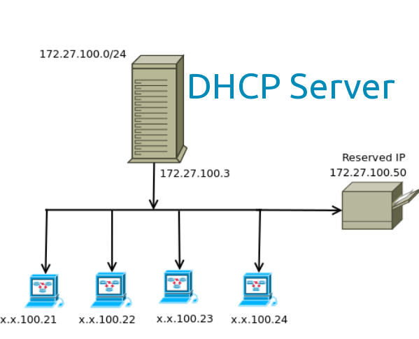
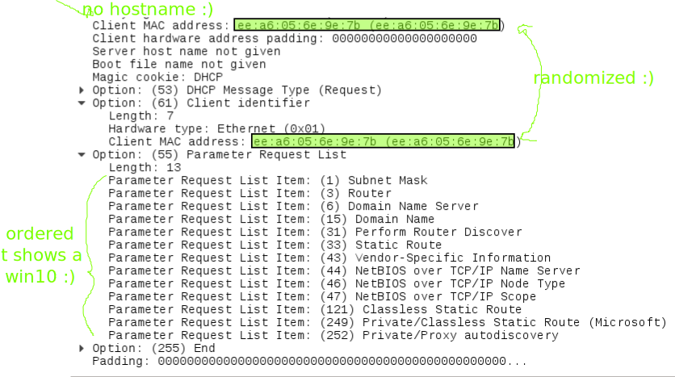
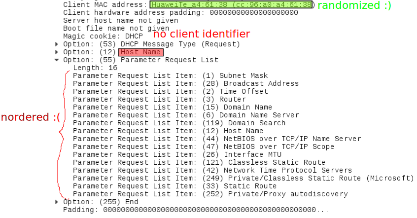
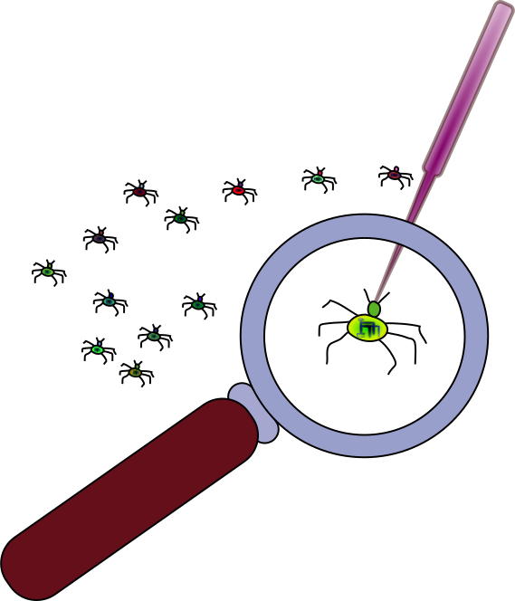

DHCP Anonymity Profiles and implementations
=============================================

34C3, Leipzig, 12/12/17

----  ----

Contents
========

- DHCP Anonymity Profiles
- `dhcpcanon`
- `systemd` DHCP client
- MirageOS DHCP client
- You can help
- Questions

----  ----

DHCP
=====

----

Anonymity Profiles
-------------------

- RFC 7844 (2016)
- MAC randomization
- Windows 10 implementation for Wifi interfaces

<!-- .element:  style="width: 50%;height: 50%;" -->

----

Summary RFC 7844
-----------------

- Do not send ``Hostname``
- Do not send ``Hardware vendor``
- ``Client identifier`` is the MAC
- ``Parameter Request List`` (minimized, randomized)
 - In implementations: same options and same order

----

Windows 10 capture
-------------------

----

ISC DHCP client (``dhclient)`` capture
----------------------------------------

----  ----

`dhcpcanon`
==============

(thanks <!-- .element:  style="width: 5%;height: 5%" --> @prototypefund)

- GPL -> MIT
- implemented in Python
- packaged for Debian
- in Gnome Network Manager still "experimental" (not compiled by default with ``dhcpcanon``)

<!-- .element:  style="width: 30%; height: 30%;" -->

<!-- .element:  style="width: 10%;height: 10%" -->

----

Ways to run dhcpcanon
-----------------------

- standalone (requires root)
- as a daemon with `systemd` (no root)
- with a [wrapper](https://github.com/infinity0/ambient-rs) (no root)
- with resolvoconf, [resolvconf-admin](https://github.com/dkg/resolvconf-admin) or `systemd-resolved`
- with Gonme Network Manager (requires root)

----  ----

`systemd` DHCP client
======================

- patched (in upstream v235)
- already in Debian sid

<!-- .element:  style="width: 50%;height: 50%" -->

----  ----

MirageOS DHCP client
========================

- ``charrua-core`` DHCP library implemented in Ocaml
- patched in upstream
- TODO:
  - client running in Unix
  - unikernel that could be run in Qubes OS
  - ...

----  ----

You can help
================

- Run and report bugs
 - `dhcpcanon` implementation
 - `systemd` DHCP client
 - Gnome Network Manager integration

<!-- .element:  style="width: 20%;height: 20%" -->

----

Include in Debian derivatives
-------------------------------

 - Tails
 - Subgraph OS

<!-- .element:  style="width: 20%;height: 20%;" -->

----

Package for other Linux OS
---------------------------

- package for your favorite OS
 - Archlinux
 - Fedora, Qubes
 - FreeBSD
 - ...

<!-- .element: style="width: 300px;" -->
<!-- .element: style="width: 150px;" -->
<!-- .element: style="width: 150px;" -->
<!-- .element: style="width: 300px;" -->

----

Implementation in other OS
---------------------------

- Android
 - MAC randomization
 - patches for DHCP client
- Apple stuff
  - Mac OS
  - iOS

<!-- .element:  style="width: 150px;" -->
 

----  ----

Questions
===========

Thanks!

juga at riseup dot net

2DA8 1D01 455C 3A00 3219  8850 F305 447A F806 D46B

https://github.com/dhcpap

<!-- .element: style="width: 20%; height: 20%;" -->
<!-- .element: style="width: 20%; height: 20%;" -->
